# Figuras importantes do Z01

Sistema completo e projetos

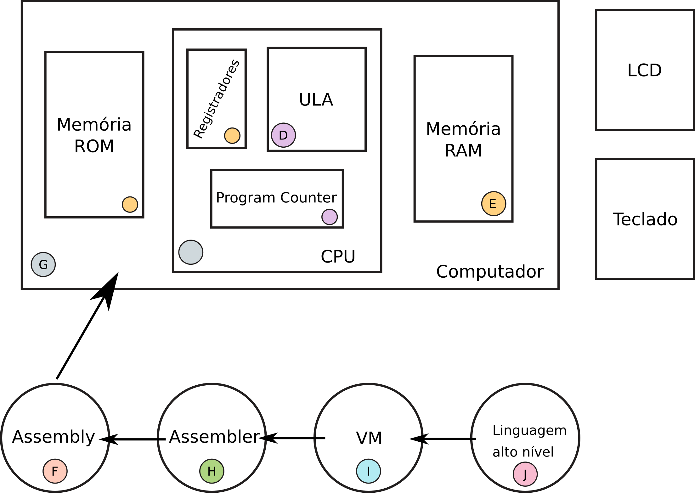

---------

Fluxo de simulação

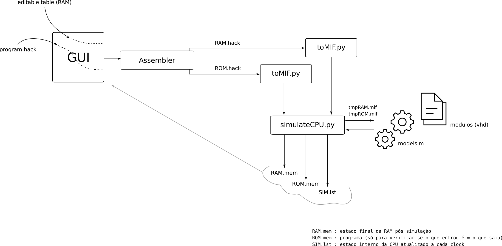

---------

Computador

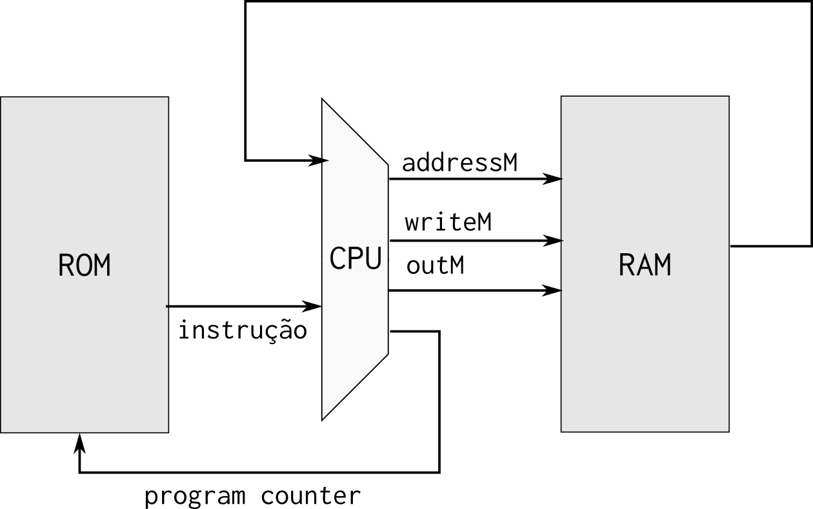

---------

CPU

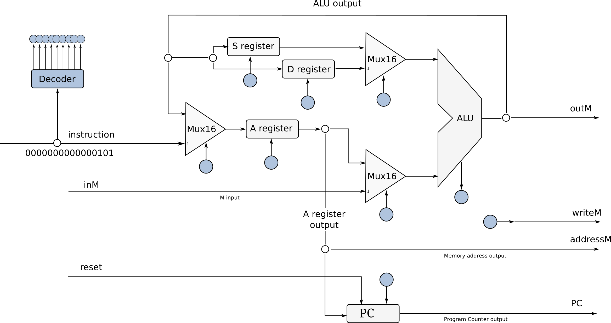

---------

ULA

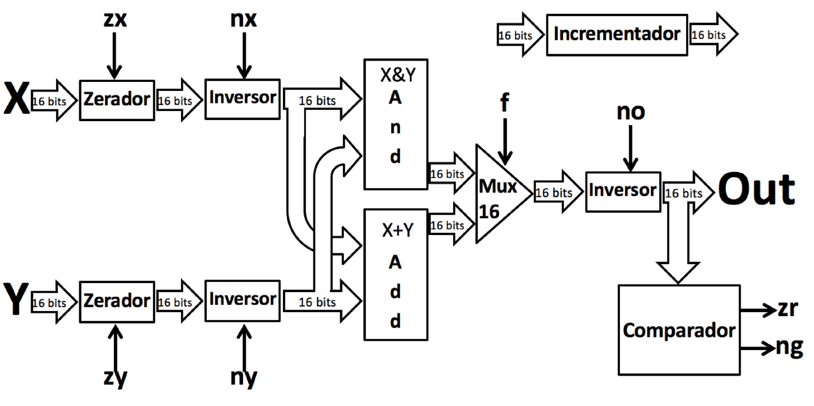

---------

Decodificador de endereços 

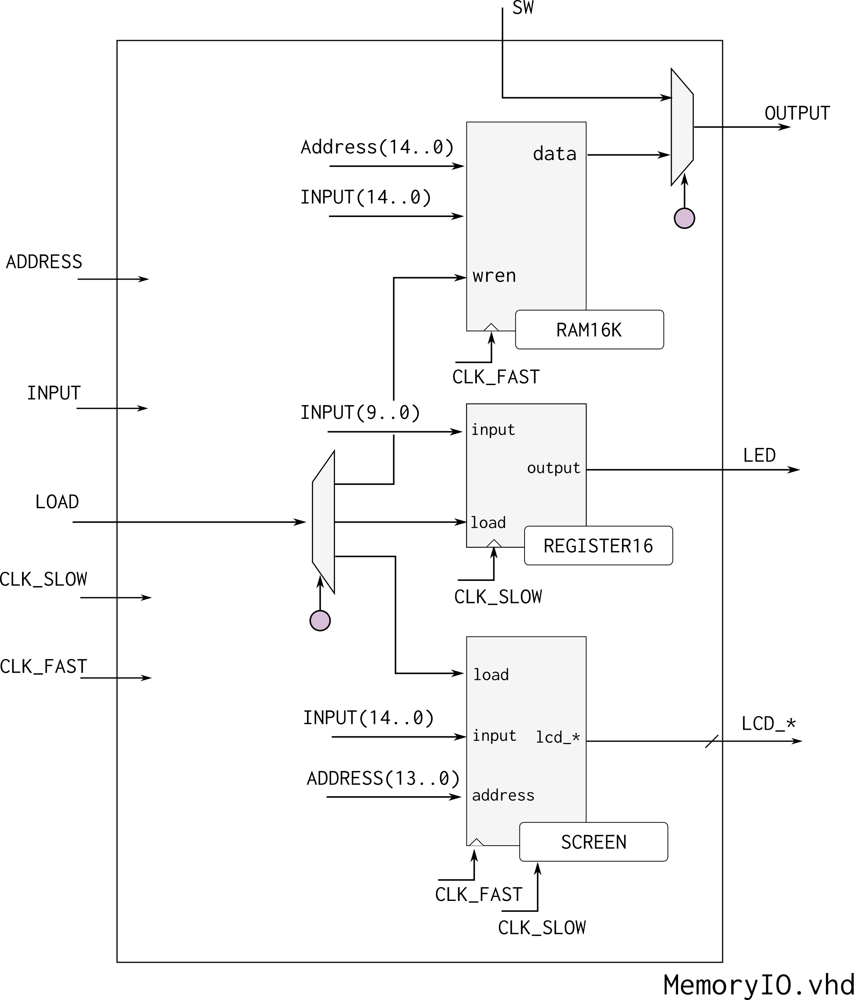

---------

Mapa de memória

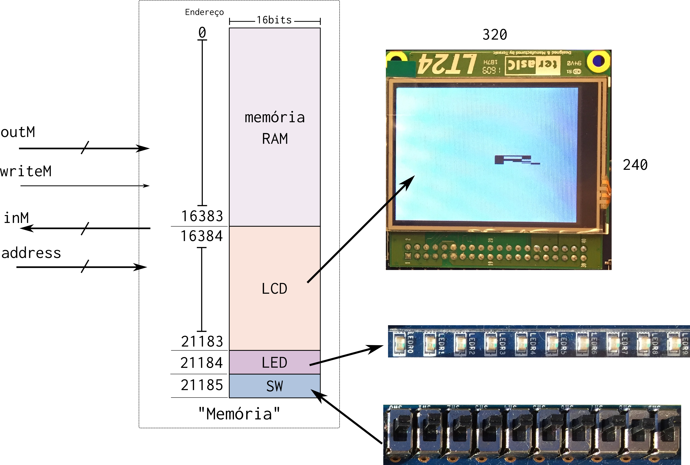

---------

LCD

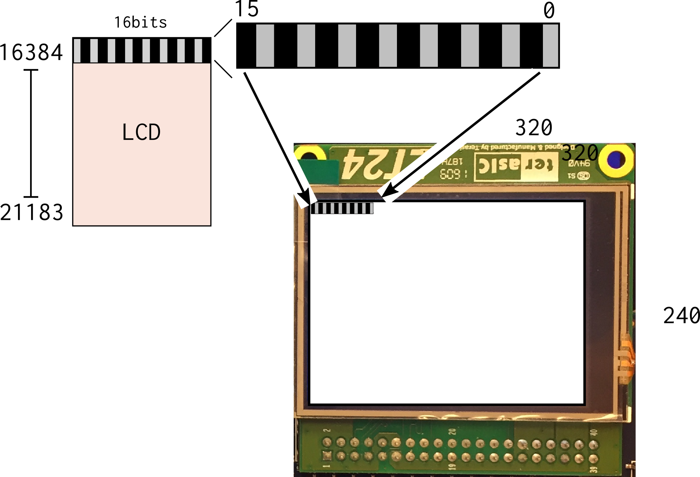

---------

Chaves

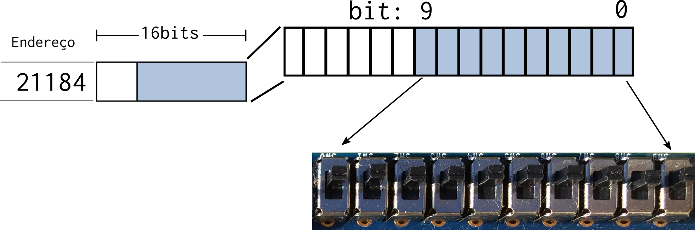

---------

LEDs

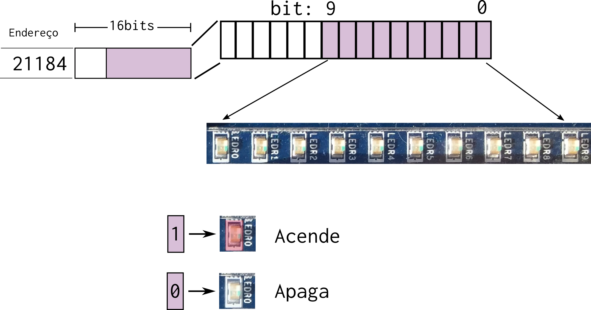

---------

Instruction Set

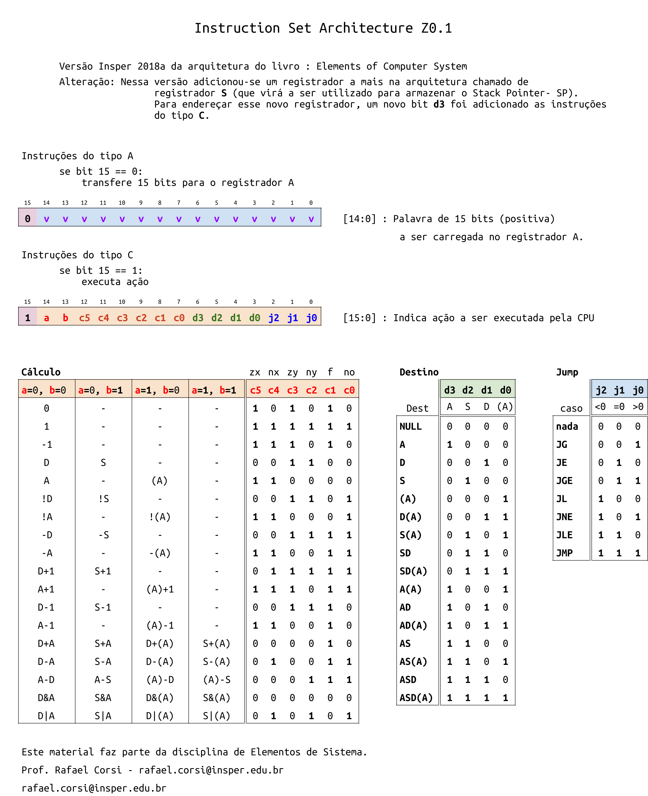

---------
