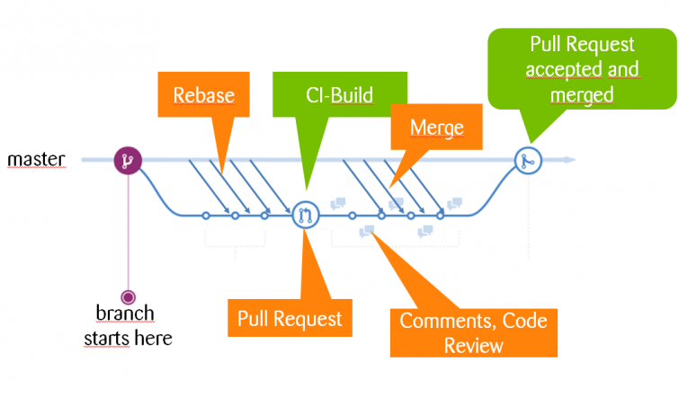
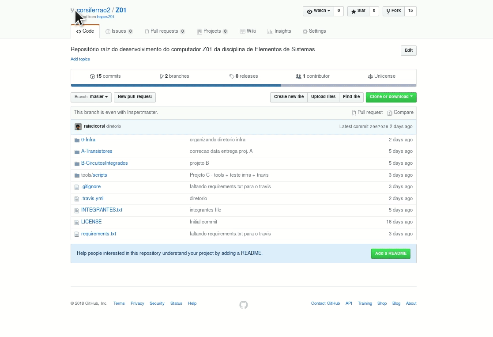

# Travis

Na página do repositório do seu FORK no github vá em *settings -> Integrations & services*, clique em *Add services* e procure pelo Travis CI, adicione ao seu projeto.

### Travis CI ?

Travis é um sistema de integração contínua que vai executar de forma automática alguns testes (criado por nós) no projeto e em caso de alguma falha irá notificar no github e por e-mail todos os integrantes.

Como ele funciona ? Ele fica verificando o repositório por alterações (você deve além de dar commit, dar push) e para cada novo commit ele faz o seguinte :

1. Inicializa uma nova máquina virtual na nuvem (ubuntu, windows, mac)
2. Instala todo a infra necessária do projeto (no caso do Z01 : python, java, Quartus, ...)
3. Executa os scripts de teste localizados em cada parte do projeto 
      - No caso desse projeto : *C-Logica-Combinacional/scripts/testeLogicaCombinacional.py*
4. Desliga e "mata" a máquina virtual recém criada.

O arquivo de configuração do travis está localizado na raiz do repositório : *Z01/.travis.yml*. Nele que estão feitas todas as definições de execução.

Na pagina do seu repositório em commits deve aparecer uma pequena bolinha em cada um dos commits novos que serão feitos no projeto, esse indicador será atualizado pelo travis sendo :

- Amarelo : O teste está em execução
- Verde : O teste passou
- Vermelho : O teste falhou

> Cada teste leva em torno de alguns minutos já que toda a infraestrutura é instalada sempre do zero, não utilize o sistema de Integração Contínua para validar as suas novas implementações, esse sistema deve ser utilizado para encontrar problemas mais amplos ou para o scram master aceitar ou não um pull-request, já que o resultado do sucesso ou não dessa requisição é visível facilmente.

## Ativando no Travis

Será necessário acessar o site do travis :

- [https://travis-ci.org/](https://travis-ci.org/) e adicione o projeto forkado ao travis :


# Github 

## Github Project

Ferramenta do github para gerenciamento de projetos (estilo Kambam), cada repositório pode ter N projetos, e o github automatiza o processo de todo/doing/done deixando de maneira visual as tarefas.

## GitHub issues

> Você deverá ativar o issues no github, vá em **Settings -> e clique em issues**

Plataforma do github para criação de tarefas, as tarefas aqui criadas serão associadas a um projeto específico e a um grupo de pessoas específicas.

## Pull-request

Maneira de um lider de projeto aceitar ou não atualizações em um código, o pull-request é criado por um usuário e revisado por outro.



## Branch

Ramo criado para implementar um feature/ correção de bug que será futuramente incorporado no master (merge)

## Master

Ramo principal do projeto, gerenciado pelo Scrum Master

# Tutorial

## configurando o github com travis + issues


## Criando um project no github



## Adicionando issues


## Modificando o código


```
-- Criando o branch
$ git checkout -B or16

--- Modificando o arquivo
/Z01/C-LogicaCombinacional/src/rtl/or16.vhd

-- Testando
python testeLogicaCombinacional.py

-- Fazendo o commit
$ git commit -am "funcionando e testado"

-- Enviando o pull request
$ git push origin or16

```

## Gerando o pull rquest


## ScrumMaster : Aceitando o pullrequest


